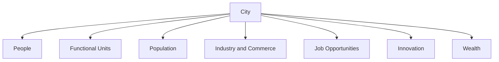
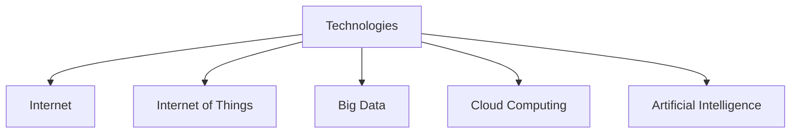

# smartCity
> 智慧城市课程作业及课设
> - 2023.12.14
## The Essence of a Smart City
1. a comprehensive network and applications of information technologies (Bollier, 1998).

### What a city means？
- 从社会的角度来看，城市是人们生活和工作的地方；
- 从技术的角度来看，它是功能单元（如交通、教育、医疗和公用事业网络）的集合；
- 从经济的角度来看，它是人口、工业和商业汇聚的地方，也是创造就业机会、创新和财富的地方。

### What is a smart city?

> - 智慧城市：应用信息和通信技术的城市，以提升其基础设施和功能单元的服务、运营和管理，有效利用其资源，实现可持续城市发展。

建设智慧城市需要考虑的因素：
- 技术因素
- 政治因素
- 生产关系或社会因素
- 上述因素之间的相互作用

结论：
- 智慧城市的本质是将信息和通信技术嵌入基础设施和服务之间的空白中，利用它们来优化城市运营和市民的日常生活。

> 我的看法：
> - 智慧城市是一个具有具体与抽象的双向接口的平台
>  - 虚拟化、信息化：平台一方面事无巨细地记录着一座城市的经济社会政治生活的所有琐碎细节
>  - 抽象化、规律化：另一方面又通过各种技术手段来抽象出城市的运行规律
>  - 双向接口：城市建设与改造遵循着这些规律，而这些规律又是由城市的运行所决定的。
>  - 本来这种反馈机制是自发的、无意识的，但是有了智慧城市这个平台，这种反馈机制就可以被人为地调节，从而实现对城市的精细化管理。

## three driving forces of the smart city development in China. 
三个推动中国智慧城市发展的重要因素：
有三个重要因素推动了中国智慧城市的发展：城市化、政策和技术。

### Urbanization
背景:
- 世界:  根据联合国的《世界城市化报告》，世界上每天有18万人在城市定居。
- 中国:
  - 国家统计局的数据显示，每年有超过1500万农村劳动力迁往城市。1980年，中国城市人口仅占总人口的20%，到2020年，这一数字已达到60%，预计到2050年，80%的人口将生活在城市中。
  - 胡焕庸线是中国人口密度的分界线，它将中国分为东部和西部两个部分。该线是由胡焕庸在1935年提出的，他是一位著名的地理学家和地图制作者。该线从北到南穿过中国，将人口密度较高的东部地区与人口密度较低的西部地区分开。今天，94%的人口生活在该线的东侧，只有6%的人口生活在该线的西侧。1935年，中国的人口约为4.75亿。到2020年，这一数字已增加到14亿，其中95%的人口生活在胡焕庸线的东侧。

结论:
- 如此持续的人口增长和城市密度增加给城市的资源和基础设施带来了巨大的挑战。传统的城市治理模式无法解决人口增加带来的交通、医疗、教育、环境、管理等方面的额外需求。因此，迫切需要一种新的城市运营和治理模式。

### Policies
中国的智慧城市建设经历了四个不同阶段：

1. **第一阶段（2010年-2014年）：早期研究与探索**
   - 2010年发布的“十二五”规划鼓励了智慧城市的发展。
   - 2012年，住房和城乡建设部发布了智慧城市试点管理暂行办法。
   - 深圳龙岗被选为首批试点城市，建立了智慧城市运营与管理中心。
   - 城市基础设施配备有传感器和计算单元，收集数据进行分析和决策。

2. **第二阶段（2014年至2016年初）：协调与规范**
   - 部委之间加强协调，以规范无序的发展。
   - 2014年8月，包括国家发展和改革委员会、住房和城乡建设部在内的八个部委发布了《关于促进智慧城市健康发展的指导意见》。

3. **第三阶段（2016年至2017年）：战略性发展**
   - 2016年初，随着“十三五”规划的发布，智慧城市概念开始成为国家战略。
   - 规划首次提出“创新型智慧城市”概念，旨在建立创新和示范性的智慧城市试点。
   - 强调通过集成信息系统取代“数据烟囱”或“数据孤岛”。

4. **第四阶段（2017年底至今）：全面发展**
   - 2017年12月，中国共产党第十九次全国代表大会报告首次提出建设“智慧社会”。
   - 这是该概念首次出现在国家政策报告中，涉及智慧城市的本土化和现代化。
   - 截至目前，在中国，所有副省级以上城市、95%的地级市和50%的县级城市都实施了智慧城市项目。

### Technologies

1. **智慧城市的三个重要推动力：**
   - 这一发展涵盖互联网、物联网、大数据、云计算和人工智能等方面的技术应用。

2. **信息与通信技术的关键作用：**
   - 传感器如热敏电阻、光敏电阻、转速表等感知城市功能变化，并将其数字化。
   - 数字化过程使计算设备能够进行数据传输、可视呈现、数据分析和智能决策。
   - 信息与通信技术为新应用和商业模式的发展创造了条件。

3. **数据的采集、传输和处理：**
   - 传感器采集的数据需要准确高效地传输。
   - 传输可通过不同介质和网络形式实现，如光纤、RFID、WiFi、LoRa和5G。
   - 数据到达目的地后需要进行处理，可以采用边缘或雾计算，也可以利用云计算进行全局优化。

4. **不同层次的信息技术的应用：**
   - 这些信息技术用于收集、分享、传输、汇总和计算城市各领域的数据。
   - 这有助于市民和市政管理者做出明智而优化的决策。

5. **深圳智慧城市的例子：**
   - 深圳智慧城市通过感知-网络-数据分析的技术模型展示了城市范围的综合视图。
   - 具体包括全面感知的地图、电子身份证实现畅行、一键了解整体情况等功能。
   - 通过“六个一”目标提升人民生活水平和治理能力，实现各种传感器收集、数据传输和分析的全过程。

## 小结

联合国2030年可持续发展议程列出了实现更美好、更可持续的全球社区的十七个目标和挑战，如图6所示。

此外，中国的智慧城市倡议受到高层政府或部委制定的国家政策的强烈推动。地方智慧城市政策不会偏离上层指导方针。这种自上而下的范式与西方智慧城市的理念截然不同，西方智慧城市的主导地位通常由地方政府和私营实体担任。

## 拓展1:万物摩尔定律
这部分文章主要强调了“Moore's Law for Everything”这一理念，探讨了两种提升生活水平的途径：个体获取更多财富或商品价格下降。文章认为降低商品成本是增加社会财富的最佳途径，而技术将在许多领域推动这种成本下降。以半导体和摩尔定律为例，说明芯片的性能在相同价格下每两年翻倍。

文章预测人工智能将降低商品和服务的成本，因为劳动力是供应链许多层面的主要成本。通过引入机器人进行建筑、医疗诊断和教育等领域，可以显著降低成本。作者呼吁实现“Moore's Law for Everything”，期望在未来几十年中，各个领域的商品，包括住房、教育、食品和服装等，每两年减半价格，创造出丰富的资源，使人们能够更加自由地追求创造性的职业。

总的来说，文章强调了技术革命通过降低商品和服务成本，为社会创造更大的财富，提供了对未来更加乐观的展望。

## 拓展2: 3D Gaussian Splatting
3D Gaussian Splatting 是一种基于光栅化技术的方法。这意味着：

- 具备描述场景的数据。
- 在屏幕上绘制这些数据。
- 这类似于计算机图形学中的三角形光栅化，用于在屏幕上绘制许多三角形。

在 3D Gaussian Splatting 中，场景通常被表示为一组点，每个点都带有诸如位置、颜色、强度或其他标量值等属性。

At a high level, 3D Gaussian splats, like NeRFs or photogrammetry methods, are a way to create a 3D scene using a set of 2D images. Practically, this means that all you need is a video or a set of photos of a scene, to obtain a 3D representation of it — enabling you to reshoot it, or render it from any angle.

从高层次来看，3D Gaussian splats（类似于NeRFs或摄影测量方法）是一种使用一组2D图像创建3D场景的方法。实际上，这意味着你只需要一个场景的视频或一组照片，就可以获得它的3D表示，从而使你能够从任何角度重新拍摄或渲染它。

Each 3D Gaussian is optimized along with a (viewdependant) color and opacity. When blended together, here's the visualization of the full model, rendered from ANY angle. As you can see, 3D Gaussian Splatting captures extremely well the fuzzy and soft nature of the plush toy, something that photogrammetry-based methods struggle to do.

每一个3D高斯都与一个（视角相关的）颜色和不透明度一起进行优化。当它们混合在一起时，这是从任何角度渲染的完整模型的可视化。正如你所看到的，3D高斯喷洒非常好地捕捉了毛绒玩具的模糊和柔软的特性，而摄影测量方法则很难做到这一点。

### 简短的训练教程
1. Structure from Motion 从图像中估计3D点云

   第一步是使用SfM方法从一组图像估计一个点云。这是一种从一组2D图像估计3D点云的方法。这可以用COLMAP库来完成。

2. Convert to Gaussians 

   接下来，每个点都被转换成一个（三维）高斯。这已经足以进行光栅化。然而，只有位置和颜色可以从SfM数据中推断出来。为了学习一个产生高质量结果的表示，我们需要对其进行训练。

3. Training

   训练过程使用随机梯度下降，类似于神经网络。训练步骤如下：

   1. 使用可微分的高斯光栅化将高斯光栅化到图像中
   2. 根据光栅化图像和真实图像之间的差异计算损失
   3. 根据损失调整高斯参数（位置、颜色、不透明度）
   4. 应用自动致密化和修剪（删除不透明度低的高斯、合并重叠的高斯等）

## Reference 
1. [Moore's Law for Everything](https://moores.samaltman.com)
2. [CityGen: Infinite and Controllable 3D City Layout Generation](https://arxiv.org/pdf/2312.01508.pdf)
3. [Generating Redstone Style Cities in Minecraft](https://arxiv.org/pdf/2307.09777.pdf)
4. [Evolutionary City: Towards a Flexible, Agile and Symbiotic System](https://arxiv.org/pdf/2311.14690.pdf)
5. [An Evolutionary Note on Smart City Development in China*](https://arxiv.org/pdf/2203.13169.pdf)
6. [智慧深圳规划纲要（2011-2020年）](http://www.szns.gov.cn/xxgk/qzfxxgkml/ghjh/zxgh/content/post_3708896.html)