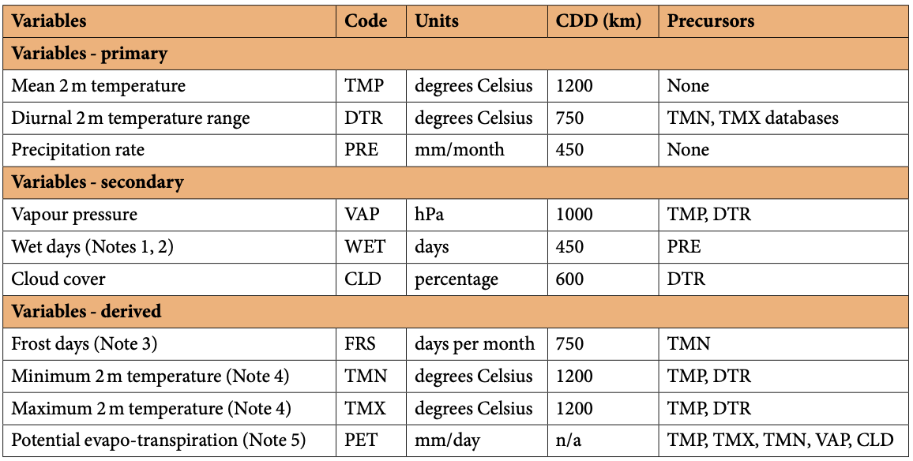
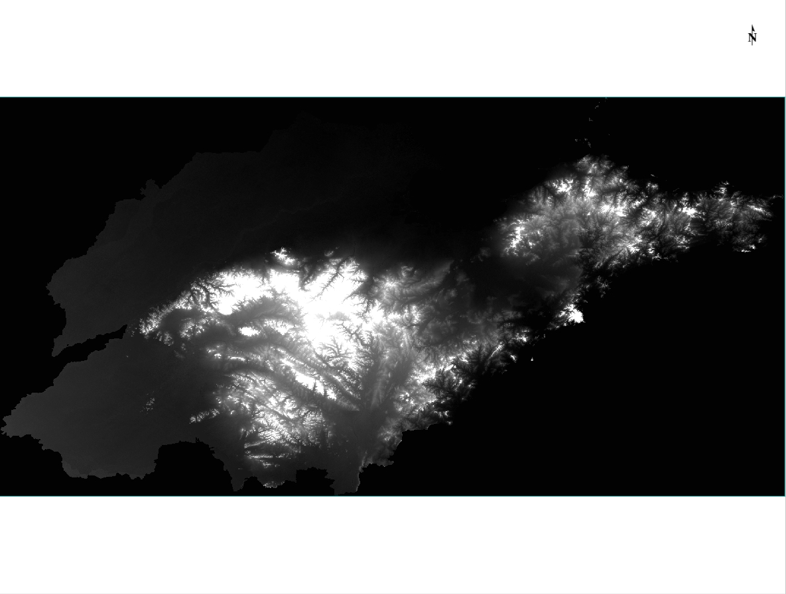
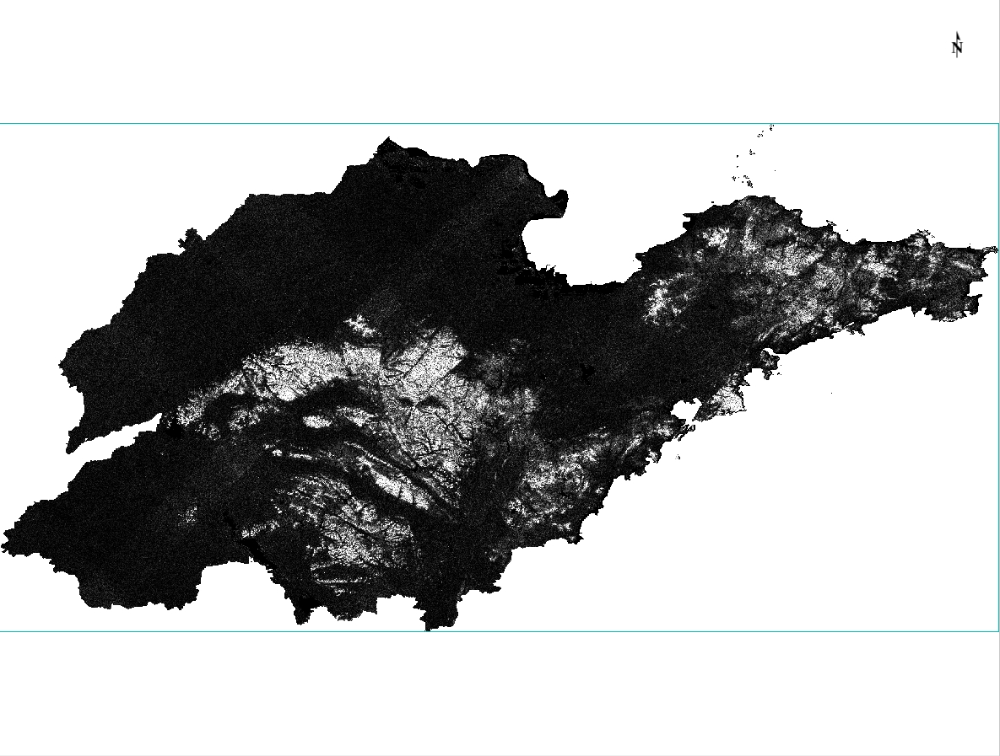
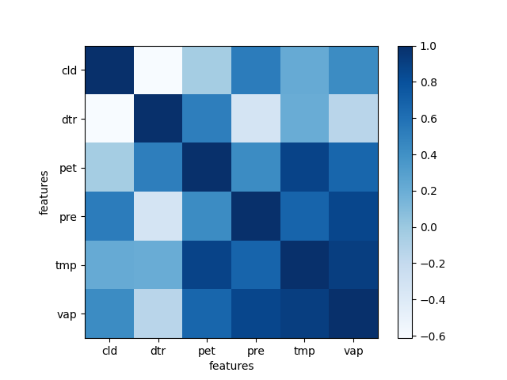
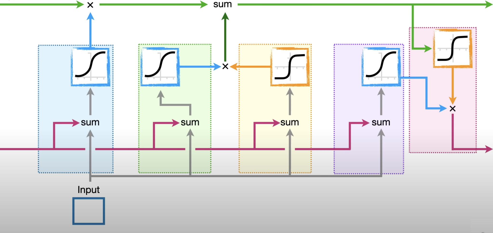

# 智慧城市实验
> 本项目是智慧城市实验的代码仓库，主要是对山东省的气象数据进行分析，以及可视化。
> - 2023.12.26 --> _ _ _ _
## 数据收集
1. 元数据及山东省行政区划数据
   - 搜集山东省各县市区的名字及中心点坐标用以组织数据。

      |地名|经度|纬度|
      |---|---|---|
      |济南|117.12|36.65|
      |青岛|120.38|36.07|
      |~|~|~|

   - 山东省行政区划数据：山东省的行政区划使用高德地图提供的 JSON 数据转化为 Shape 文件，然后上传至 GEE 平台。
  
   - 
2. 气象数据收集: 气象数据采用 [Version 4 of the CRU TS monthly high-resolution gridded multivariate climate dataset](https://www.nature.com/articles/s41597-020-0453-3) 数据集提供的高精度月度全球气象数据，我们截取近十年的（2011～2020）气象数据用作分析。其中包含 10 个气象指标，分别是：我们仅选择未被划去的气象指标。
> - 数据以 0.5°×0.5° 的分辨率提供，即每个格子的边长为 50km，每个格子的中心点坐标为：经度：0.25°+0.5°*i，纬度：-89.75°+0.5°*j，其中 i,j 为格子的索引，从 0 开始。
> - 数据以 `cru_ts4.06.2011.2020.XXX.dat.nc.gz`格式命名。
> - 只选取： `cld,dtr,pet,pre,tmp,vap` 六个气象指标，其中 `cld,dtr,pet,pre,tmp,vap` 分别对应的是：云量、日较差、潜在蒸发量、降水量、温度、水汽压。

   1. cld : cloud amount 是云量，即云的覆盖程度。
   2. dtr : diurnal temperature range 是日较差，即最高温和最低温度的差值。
   3. ~~frs : 月霜冻日数，即月度霜冻日数。~~
   4. pet : 潜在蒸发量又称潜在蒸发散量（Potential Evapotranspiration，即PET），是指充分供水下垫面（即充分湿润表面或开阔水体）蒸发/蒸腾到空气中的水量，又称可能蒸发散量或蒸发能力。
   5. pre : precipitation 是降水量，即降水的总量。
   6. ~~tmn : mean of minimum temperature 是最低温度的平均值。~~
   7. tmp : mean of temperature 是温度的平均值。
   8. ~~tmx : mean of maximum temperature 是最高温度的平均值。~~
   9.  vap : vapor pressure 是水汽压。
   10. ~~wet : wet day frequency 是湿日频率，即年度湿日数。~~

   
   > CRU TS变量，显示代码、单位、相关衰减距离（CDD）和前驱因素
   > - wet：湿日是指降水量 ≥ 0.1毫米的日子
   > - tmn,tmx：最低和最高温度是每月个别日最低和最高温度的平均值，它们不是每月记录的整体最低或最高温度

3. 地形数据收集: 使用山东省行政区划边界裁剪 DEM 数据，并计算对应县市区的平均高程。
   3.1 GEE 平台数据获取: 以下是处理代码。从平台上提供的 SRTM30 数据集下载山东省 30 米分辨率的 DEM 数据及坡度数据。而后根据每一个县的中心点坐标获取对应的 DEM 及坡度数据，以便后续分析。
   ```js
      var elevation = SRTM30.select('elevation').clip(SD);
      var slope = ee.Terrain.slope(elevation);
      // 可视化参数
      var args = {
         crs: 'EPSG:3857',
         dimensions: '300',
         region: SD,
         min: -2000,
         max: 10000,
         palette: 'green, blanchedalmond,orange,black ',
         framesPerSecond: 12,
      };
      //  Map.addLayer(elevation,args,'elevation');
      //  Map.addLayer(slope,{},'slope');
      Export.image.toDrive({
      image: elevation,   
      scale: 30, 
      maxPixels: 1e13,
      region: SD });

      Export.image.toDrive({
      image: slope,
      scale: 30,
      maxPixels: 1e13,
      region: SD });
   ```
   
   

## 数据处理
1. 气象数据处理
   > 获取的气象数据是以`*.nc`结尾的数据(NetCDF---Network Common Data Form)，可以使用 netCDF4 python 库处理。
   1.1. 处理思路：
      - 由于我们的气象数据是以 0.5°×0.5° 的分辨率提供，即每个格子的边长为 50km，每个格子的中心点坐标为：经度：0.25°+0.5°*i，纬度：-89.75°+0.5°*j，其中 i,j 为格子的索引，从 0 开始。因此，我们可以根据每个县的中心点坐标获取对应的气象数据，以便后续分析。
      - 首先读取元数据，也就是前面提到的 `山东省各县市区的名字及中心点坐标表`，根据表中记录的中心点坐标，获取对应的气象数据。方便起见，我们将六个气象指标的数据分别存储在一个 `*.csv` 文件中，每个文件的列名为：`X`，其中 `X` 为对应县在元数据表中的索引号。
   1.2. 处理结果：

      

      |type|2011.1|2011.2|...|2020.12|
      |---|---|---|---|---|
      |cld|3.629999923706054688e+01|5.800000000000000000e+01|...|~|
      |dtr|8.800000190734863281e+00|9.000000000000000000e+00|...|~|
      |pet|1.399999976158142090e+00|1.800000071525573730e+00|...|~|
      |pre|0.000000000000000000e+00|1.490000057220458984e+01|...|~|
      |tmp|-3.500000000000000000e+0|2.000000000000000000e+0|...|~|
      |vap|1.600000023841857910e+00|3.500000000000000000e+00|...|~|

   1.3. 各气象要素相关性分析(以济南市 120 个月的数据为例)
   
   

2. 地形数据处理
   ```py
   import geopandas
   import rasterio
   import matplotlib.pyplot as plt
   from shapely.geometry import Point
   # from county.csv 加载 points
   gdf = geopandas.read_file("county.csv")
   # 读取 DEM 数据
   src = rasterio.open("DEM.tif")
   # src = rasterio.open("slope.tif")
   from rasterio.plot import show

   fig, ax = plt.subplots()

   # transform rasterio plot to real world coords
   extent = [src.bounds[0], src.bounds[2], src.bounds[1], src.bounds[3]]
   ax = rasterio.plot.show(src, extent=extent, ax=ax, cmap="pink")

   gdf.plot(ax=ax)
   coord_list = [(x, y) for x, y in zip(gdf["geometry"].x, gdf["geometry"].y)]
   ```
## 模型
1. 概述：
   > - 时间序列分析包括分析时间序列数据的方法，以提取数据的有意义的统计数据和其他特征。时间序列预测是使用模型根据先前观察到的值来预测未来值。虽然回归分析通常被用来测试一个或多个不同时间序列之间的关系，但这种类型的分析通常不被称为“时间序列分析”，这种分析特指单个序列中不同时间点之间的关系。

   - 模型选择：考虑到我们收集的气象数据是典型的时间序列数据，因此我们采用循环神经网络来分析气象数据。
   - 输入输出：我们的输入数据是气象参数时间序列，输出数据降水量序列。
     - 例如，对于某一区域，我们有 2011.1 至 2020.12 共计 120 个月的 5 参数气象数据，将它们排列为矩阵就是：$X_{5\times 120}$，其中 $X$ 为气象数据矩阵，5 为气象参数个数，120 为时间序列长度。
     - 而我们的输出数据是降水量序列，也就是 2011.1 至 2020.12 共计 120 个月的降水量数据，将它们排列为矩阵就是：$Y_{1\times 120}$，其中 $Y$ 为降水量数据矩阵，1 为降水量参数个数，120 为时间序列长度。

2. 模型结构：LSTM(长短期记忆网络)
   - LSTM 是一种时间循环神经网络，由于其特殊的结构，可以很好进行时间序列的分析。
   - LSTM 模块的结构如下图所示：
      
      - LSTM 的核心思想是：在每个时间步，都会有一个输出 $h_t$ 和一个记忆单元 $c_t$，它们的计算公式如下：
         - $f_t=\sigma(W_f\cdot[h_{t-1},x_t]+b_f)$
         - $i_t=\sigma(W_i\cdot[h_{t-1},x_t]+b_i)$
         - $\tilde{c}_t=\tanh(W_c\cdot[h_{t-1},x_t]+b_c)$
         - $c_t=f_t\cdot c_{t-1}+i_t\cdot\tilde{c}_t$
         - $o_t=\sigma(W_o\cdot[h_{t-1},x_t]+b_o)$
         - $h_t=o_t\cdot\tanh(c_t)$

3. 模型代码实现(基于 pytorch 库)
   该模型是在循环神经网络的基础上，加入了 LSTM 模块，代码如下：
   ```py
   # Recurrent neural network with LSTM (many-to-many)
   class RNN_LSTM(nn.Module):
      def __init__(self, input_size, hidden_size, num_layers, num_classes):
         super(RNN_LSTM, self).__init__()
         self.hidden_size = hidden_size
         self.num_layers = num_layers
         # self.cnn2d = nn.Conv2d(1, 1, (1, 5))
         self.lstm = nn.LSTM(input_size, hidden_size, num_layers, batch_first=True)
         # self.fc = nn.Linear(hidden_size * sequence_length, num_classes, bias=True)
         # 将 120 个月的数值 每个月的数值控制在 0-300 之间
         self.fc = nn.Linear(hidden_size * sequence_length, num_classes, bias=True)
         
      def forward(self, x):
         # Set initial hidden and cell states
         h0 = torch.zeros(self.num_layers, x.size(0), self.hidden_size).to(device)
         c0 = torch.zeros(self.num_layers, x.size(0), self.hidden_size).to(device)

         # Forward propagate LSTM
         out, _ = self.lstm(
               x, (h0, c0)
         )  # out: tensor of shape (batch_size, seq_length, hidden_size)
         out = out.reshape(out.shape[0], -1)
         out = self.fc(out)
         return out
   ```

## 模型训练
1. 数据集划分：我们将数据集划分为训练集、测试集，其中训练集占 80%，测试集占 20%。模型在训练集上训练，然后在测试集上测试。数据集划分函数：
   ```python
   def train_test_idx(total, train_ratio=0.8, startByOne=True):
    '''
    传入数据集的总数
    返回一个 list 包含所有数据的索引 乱序
    '''
    if startByOne: # [1,2,3,4,5,6,7,8,9,10]
        idx = np.arange(1, total+1)
    else: # [0,1,2,3,4,5,6,7,8,9]
        idx = np.arange(total)

    np.random.shuffle(idx)
    train_idx = idx[:int(total*train_ratio)]
    test_idx = idx[int(total*train_ratio):]
    return train_idx, test_idx

    if __name__ == '__main__':

    # use train_test_idx to get train_idx and test_idx and save as csv
    train_idx, test_idx = train_test_idx(116)
    np.savetxt('data/CRU/processed/train_idx.csv', train_idx, delimiter=',', fmt='%d')
    np.savetxt('data/CRU/processed/test_idx.csv', test_idx, delimiter=',', fmt='%d')
   ```
2. 模型训练
   - 输入数据为 $X_{5\times 120}$，输出数据为 $Y_{1\times 120}$，其中 $X$ 为气象数据矩阵，5 为气象参数个数，120 为时间序列长度，$Y$ 为降水量数据矩阵，1 为降水量参数个数，120 为时间序列长度。
   - 模型训练：模型会根据输入数据 $X$ 和输出数据 $Y$ 来调整自身的参数，使得输出数据 $Y$ 越来越接近真实的降水量数据。
   - 模型数据流图:
   ```mermaid
      graph LR
      A[气象数据] --> B[模型]
      B --> C[预测降水量]
      C --> D[真实降水量]
      D --> E[计算误差]
      E --> F[误差反向传播]
      F --> G[调整模型参数]
      G --> B

      style A fill:#a3a
      style G fill:#a3a
   ```
   - 模型训练代码: 训练代码如下，其中 `train_loader` 是训练数据集，`test_loader` 是测试数据集，`model` 是模型，`criterion` 是损失函数，`optimizer` 是优化器，`num_epochs` 是训练轮数。
   ```py
   # ...
   min_loss = 1000000
   losses = []
   accs = []
   # Train Network
   for epoch in range(num_epochs):
      for batch_idx, (data, targets) in enumerate(tqdm(train_loader)):
         # Get data to cuda if possible
         data = data.to(device=device)
         targets = targets.to(device=device)
         # forward
         scores = model(data)
         loss = criterion(scores, targets)
         # backward
         optimizer.zero_grad()
         loss.backward()
         # gradient descent update step/adam step
         optimizer.step()
         losses.append(loss.item())
      # check_accuracy(test_loader, model, error=0.1)
   save_model(model, optimizer, save_path('model/', 'model'))
   plot_loss(losses)
   ```
## 模型推理及结果分析
1. 模型推理代码: 推理代码如下，其中 `model_path` 是模型保存的路径，`data` 是输入数据，`label` 是真实的降水量数据。
   ```py
   # inference
   # load_model(model, optimizer, save_path('model/', 'model'))
   model_path = save_path('model/', 'model')
   data,label = test_dataset[10]
   data = data.unsqueeze(0)
   data = data.to(device=device)
   label = label.to(device=device)

   # Initialize network (try out just using simple RNN, or GRU, and then compare with LSTM)
   model = RNN_LSTM(input_size, hidden_size, num_layers, pridict_lenth).to(device)
   model.load_state_dict(torch.load(model_path)['model_state_dict']) # 加载模型
   model.eval() # 设置为评估模式
   with torch.no_grad():
      scores = model(data)
      scores = scaler_y.inverse_transform(scores.cpu().numpy())
      label = scaler_y.inverse_transform([label.cpu().numpy()])
      print(scores)
      print(label)
      # 保存为 csv
      np.savetxt('scores.csv', scores, delimiter=',')
      np.savetxt('label.csv', label, delimiter=',')

      plt.plot(scores[0], label='predict')
      plt.plot(label[0], label='real')
      plt.legend()
      plt.show()
   ```
2.模型推理结果误差分析


## GRU
门控循环单元（Gated Recurrent Unit，GRU）是一种递归神经网络（RNN）的变体，旨在解决传统RNN中的长期依赖问题。GRU的设计采用了门控机制，有效地处理了梯度消失和梯度爆炸的挑战，使其在序列建模任务中表现出色。

GRU包含了重置门（Reset Gate）和更新门（Update Gate）两个关键的门控部分。这两个门控部分的引入赋予了网络更灵活的学习能力。以下是对GRU关键部分的详细描述：

1. **重置门（Reset Gate）：** 重置门的作用是决定过去信息的保留程度。它通过一个sigmoid激活函数产生的值，用于控制是否将过去的信息进行重置。重置门的计算公式如下：
   $$r_t = \sigma(W_r \cdot [h_{t-1}, x_t])$$
   其中，$W_r$ 是重置门的权重矩阵。

2. **更新门（Update Gate）：** 更新门用于控制新信息的输入。它决定了当前时刻的输入对隐藏状态的影响程度。更新门的计算公式如下：
   $$z_t = \sigma(W_z \cdot [h_{t-1}, x_t])$$
   其中，$W_z$ 是更新门的权重矩阵。

通过这两个门的控制，GRU的隐藏状态更新规则如下：
$$h_t = (1-z_t) \cdot h_{t-1} + z_t \cdot \tilde{h}_t$$
其中，$\tilde{h}_t$ 是当前时刻的输入，计算公式如下：
$$\tilde{h}_t = \tanh(W \cdot [r_t \cdot h_{t-1}, x_t])$$
其中，$W$ 是权重矩阵。

下面是一个简单的用Python和TensorFlow实现的GRU代码片段：

```python
import tensorflow as tf

class GRU(tf.keras.layers.Layer):
    def __init__(self, units):
        super(GRU, self).__init__()
        self.units = units

    def build(self, input_shape):
        input_dim = input_shape[-1]
        self.Wr = self.add_weight(shape=(input_dim + self.units, self.units),
                                  initializer='uniform',
                                  trainable=True)
        self.Wz = self.add_weight(shape=(input_dim + self.units, self.units),
                                  initializer='uniform',
                                  trainable=True)
        self.W = self.add_weight(shape=(input_dim + self.units, self.units),
                                 initializer='uniform',
                                 trainable=True)

    def call(self, inputs, initial_state):
        h_prev = initial_state
        x = tf.concat([h_prev, inputs], axis=-1)

        r_t = tf.sigmoid(tf.matmul(x, self.Wr))
        z_t = tf.sigmoid(tf.matmul(x, self.Wz))

        x_tilde = tf.tanh(tf.matmul(tf.concat([r_t * h_prev, inputs], axis=-1), self.W))

        h_t = (1 - z_t) * h_prev + z_t * x_tilde

        return h_t

# 使用例子
units = 64
gru_layer = GRU(units)

# 假设输入维度为input_dim
input_dim = 32
input_data = tf.random.normal(shape=(1, input_dim))
initial_state = tf.zeros(shape=(1, units))

output_state = gru_layer(input_data, initial_state)
```

这是一个简单的GRU实现，供参考。在实际应用中，通常会使用深度学习框架提供的内置GRU层，如TensorFlow或PyTorch。
## Reference
1. [Version 4 of the CRU TS monthly high-resolution gridded multivariate climate dataset](https://www.nature.com/articles/s41597-020-0453-3)
2. [全国省市县矢量边界提取kml,shp,svg格式下载](https://dx3377.com/map/bound)
3. [SRTM30 DOCUMENTATION](https://icesat.gsfc.nasa.gov/icesat/tools/SRTM30_Documentation.html)
4. [Time series](https://en.wikipedia.org/wiki/Time_series)
5. 