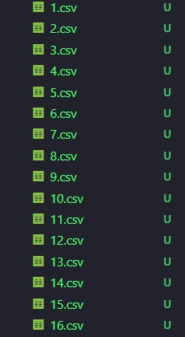

# 智慧城市实验
> 本项目是智慧城市实验的代码仓库，主要是对山东省的气象数据进行分析，以及可视化。
> - 2023.12.26 --> _ _ _ _
## 数据收集
1. 元数据及山东省行政区划数据
   - 搜集山东省各县市区的名字及中心点坐标用以组织数据。

      |地名|经度|纬度|
      |---|---|---|
      |济南|117.12|36.65|
      |青岛|120.38|36.07|
      |~|~|~|

   - 山东省行政区划数据：山东省的行政区划使用高德地图提供的 JSON 数据转化为 Shape 文件，然后上传至 GEE 平台。
  
   - 
2. 气象数据收集: 气象数据采用 [Version 4 of the CRU TS monthly high-resolution gridded multivariate climate dataset](https://www.nature.com/articles/s41597-020-0453-3) 数据集提供的高精度月度全球气象数据，我们截取近十年的（2011～2020）气象数据用作分析。其中包含 10 个气象指标，分别是：我们仅选择未被划去的气象指标。
> - 数据以 0.5°×0.5° 的分辨率提供，即每个格子的边长为 50km，每个格子的中心点坐标为：经度：0.25°+0.5°*i，纬度：-89.75°+0.5°*j，其中 i,j 为格子的索引，从 0 开始。
> - 数据以 `cru_ts4.06.2011.2020.XXX.dat.nc.gz`格式命名。
> - 只选取： `cld,dtr,pet,pre,tmp,vap` 六个气象指标，其中 `cld,dtr,pet,pre,tmp,vap` 分别对应的是：云量、日较差、潜在蒸发量、降水量、温度、水汽压。

   1. cld : cloud amount 是云量，即云的覆盖程度。
   2. dtr : diurnal temperature range 是日较差，即最高温和最低温度的差值。
   3. ~~frs : 月霜冻日数，即月度霜冻日数。~~
   4. pet : 潜在蒸发量又称潜在蒸发散量（Potential Evapotranspiration，即PET），是指充分供水下垫面（即充分湿润表面或开阔水体）蒸发/蒸腾到空气中的水量，又称可能蒸发散量或蒸发能力。
   5. pre : precipitation 是降水量，即降水的总量。
   6. ~~tmn : mean of minimum temperature 是最低温度的平均值。~~
   7. tmp : mean of temperature 是温度的平均值。
   8. ~~tmx : mean of maximum temperature 是最高温度的平均值。~~
   9.  vap : vapor pressure 是水汽压。
   10. ~~wet : wet day frequency 是湿日频率，即年度湿日数。~~

   
   > CRU TS变量，显示代码、单位、相关衰减距离（CDD）和前驱因素
   > - wet：湿日是指降水量 ≥ 0.1毫米的日子
   > - tmn,tmx：最低和最高温度是每月个别日最低和最高温度的平均值，它们不是每月记录的整体最低或最高温度

3. 地形数据收集: 使用山东省行政区划边界裁剪 DEM 数据，并计算对应县市区的平均高程。
   3.1 GEE 平台数据获取: 以下是处理代码。从平台上提供的 SRTM30 数据集下载山东省 30 米分辨率的 DEM 数据及坡度数据。而后根据每一个县的中心点坐标获取对应的 DEM 及坡度数据，以便后续分析。
   ```js
      var elevation = SRTM30.select('elevation').clip(SD);
      var slope = ee.Terrain.slope(elevation);
      // 可视化参数
      var args = {
         crs: 'EPSG:3857',
         dimensions: '300',
         region: SD,
         min: -2000,
         max: 10000,
         palette: 'green, blanchedalmond,orange,black ',
         framesPerSecond: 12,
      };
      //  Map.addLayer(elevation,args,'elevation');
      //  Map.addLayer(slope,{},'slope');
      Export.image.toDrive({
      image: elevation,   
      scale: 30, 
      maxPixels: 1e13,
      region: SD });

      Export.image.toDrive({
      image: slope,
      scale: 30,
      maxPixels: 1e13,
      region: SD });
   ```
   
   

## 数据处理
1. 气象数据处理
   > 获取的气象数据是以`*.nc`结尾的数据(NetCDF---Network Common Data Form)，可以使用 netCDF4 python 库处理。
   1.1. 处理思路：
      - 由于我们的气象数据是以 0.5°×0.5° 的分辨率提供，即每个格子的边长为 50km，每个格子的中心点坐标为：经度：0.25°+0.5°*i，纬度：-89.75°+0.5°*j，其中 i,j 为格子的索引，从 0 开始。因此，我们可以根据每个县的中心点坐标获取对应的气象数据，以便后续分析。
      - 首先读取元数据，也就是前面提到的 `山东省各县市区的名字及中心点坐标表`，根据表中记录的中心点坐标，获取对应的气象数据。方便起见，我们将六个气象指标的数据分别存储在一个 `*.csv` 文件中，每个文件的列名为：`X`，其中 `X` 为对应县在元数据表中的索引号。
   1.2. 处理结果：

      

      |type|2011.1|2011.2|...|2020.12|
      |---|---|---|---|---|
      |cld|3.629999923706054688e+01|5.800000000000000000e+01|...|~|
      |dtr|8.800000190734863281e+00|9.000000000000000000e+00|...|~|
      |pet|1.399999976158142090e+00|1.800000071525573730e+00|...|~|
      |pre|0.000000000000000000e+00|1.490000057220458984e+01|...|~|
      |tmp|-3.500000000000000000e+0|2.000000000000000000e+0|...|~|
      |vap|1.600000023841857910e+00|3.500000000000000000e+00|...|~|

2. 地形数据处理

## Reference
1. [Version 4 of the CRU TS monthly high-resolution gridded multivariate climate dataset](https://www.nature.com/articles/s41597-020-0453-3)
2. [全国省市县矢量边界提取kml,shp,svg格式下载](https://dx3377.com/map/bound)
3. [SRTM30 DOCUMENTATION](https://icesat.gsfc.nasa.gov/icesat/tools/SRTM30_Documentation.html)


