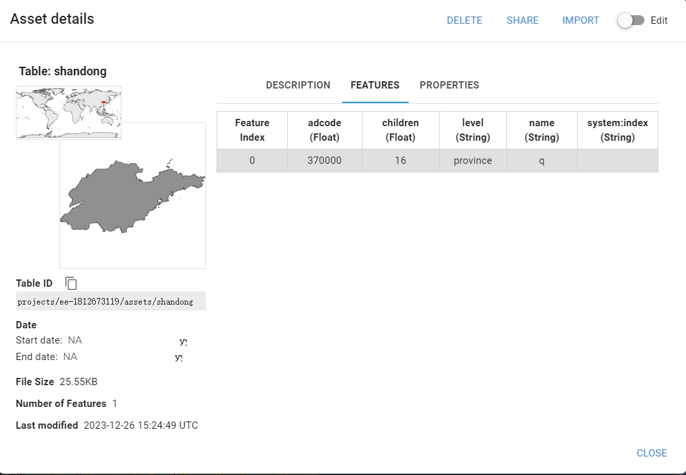

# 智慧城市实验
> 本项目是智慧城市实验的代码仓库，主要是对山东省的气象数据进行分析，以及可视化。
> - 2023.12.26 --> _ _ _ _
## 数据
1. 元数据及山东省行政区划数据
   - 搜集山东省各县市区的名字及中心点坐标用以组织数据。

      |地名|经度|纬度|
      |---|---|---|
      |济南|117.12|36.65|
      |青岛|120.38|36.07|

   - 山东省行政区划数据：山东省的行政区划使用高德地图提供的 JSON 数据转化为 Shape 文件，然后上传至 GEE 平台。
  
   - 
2. 气象数据收集
   
   1. cld : cloud amount 是云量，即云的覆盖程度。
   2. dtr : diurnal temperature range 是日较差，即最高温和最低温度的差值。
   3. frs : 月霜冻日数，即月度霜冻日数。
   4. pet : 潜在蒸发量又称潜在蒸发散量（Potential Evapotranspiration，即PET），是指充分供水下垫面（即充分湿润表面或开阔水体）蒸发/蒸腾到空气中的水量，又称可能蒸发散量或蒸发能力。
   5. pre : precipitation 是降水量，即降水的总量。
   6. tmn : mean of minimum temperature 是最低温度的平均值。
   7. tmp : mean of temperature 是温度的平均值。
   8. tmx : mean of maximum temperature 是最高温度的平均值。
   9.  vap : vapor pressure 是水汽压。
   10. wet : wet day frequency 是湿日频率，即年度湿日数。
   
3. 地形数据收集: 使用山东省行政区划边界裁剪 DEM 数据，并计对应县市区的平均高程。

## Reference
1. [全国省市县矢量边界提取kml,shp,svg格式下载](https://dx3377.com/map/bound)